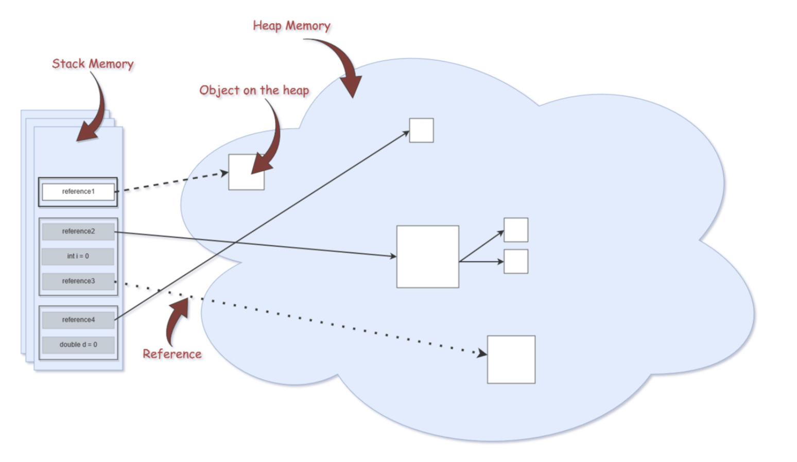

# 아이템 07. 다 쓴 객체 참조를 해제하라

>  C++에선 메모리를 직접 관리하다가, GC 가 있는 자바? 너무 좋아...
>
> 그럼에도, 메모리 관리는 신경써야 한다!

## 메모리 누수

스택을 작성했다.

```java
public class Stack {
  private Object[] elements;
  private int size = 0;
  private static final int DEFAULT_INITIAL_CAPACITY = 16;
  
  public Stack() {
    elements = new Object[DEFAULT_INITIAL_CAPACITY];
  }
  
  public void push(Object e){
    ensureCapacity();
    elements[size++] = e;
  }
  
  public Object Pop(){
    if (size == 0)
      throw new EmptyStackException();
    return elements[--size];
  }
  
  private void ensureCapacity() {
    if(elements.length == size){
      elements = Arrays.copyOf(elements, 2 * size + 1);
    }
  }
  
}
```

객체를 더이상 참조하지 안아도, 다 쓴 참조를 갖고 있는 상황에서 메모리 누수가 발생한다!

size 만 조절해서 객체가 사용되지 않아도 여전히 참조를 갖고있기 때문...!

```java
  public Object Pop(){
    if (size == 0)
      throw new EmptyStackException();
    Object result = elements[--size];
    elements[size] = null;
    return object;
  }
```

다만 이런 null 처리는 예외적인 경우여야 한다...!

다 쓴 참조를 해제하는 방법은 유효 범위(scope) 밖으로 보내는 것!


### 캐시에도 주의!

캐시 역시 메모리 누수를 일으키는 주범!


해결 방법

- WeakHashMap 을 사용해서 캐시를 만들자.
  - 단 특수한 상황!
  - 캐시 외부에서 키를 참조하는 동안만 엔트리가 살아있는 캐시가 필요한 상황
- 캐시 유효기간 정의
  - 쓰지 않는 엔트리 청소
  - 백그라운드 스레드나 새 엔트리 추가 시 부수 작업으로 수행


### 또 다른 메모리 누수 주범 - 리스너/콜백

클라이언트가 콜백 등록만 하고 해지하지 않으면 콜백이 쌓여간다.

-> 약한 참조로 저장하면 GC 가 즉시 수거.

 


## 우아하게 참조를 해제하기

유효 Scope 밖으로 넘어가면? 자동 GC 대상

**Unreachable Ojbect 가 되었을 때!**



#### Stack

#### Stack


- Heap 영역에 생성된 Object 타입의 데이터의 참조값이 할당된다.
- 원시타입의 데이터가 값과 함께 할당된다.
- 지역변수들은 scope 에 따른 visibility 를 가진다.
- 각 Thread 는 자신만의 stack 을 가진다.

#### Heap

- Heap 영역에는 주로 긴 생명주기를 가지는 데이터들이 저장된다. (대부분의 오브젝트는 크기가 크고, 서로 다른 코드블럭에서 공유되는 경우가 많다)
- 애플리케이션의 모든 메모리 중 stack 에 있는 데이터를 제외한 부분이라고 보면 된다.
- 모든 Object 타입(Integer, String, ArrayList, ...)은 heap 영역에 생성된다.
- 몇개의 스레드가 존재하든 상관없이 단 하나의 heap 영역만 존재한다.
- Heap 영역에 있는 오브젝트들을 가리키는 레퍼런스 변수가 stack 에 올라가게 된다.


## 참조

- https://yaboong.github.io/java/2018/05/26/java-memory-management/
- 

